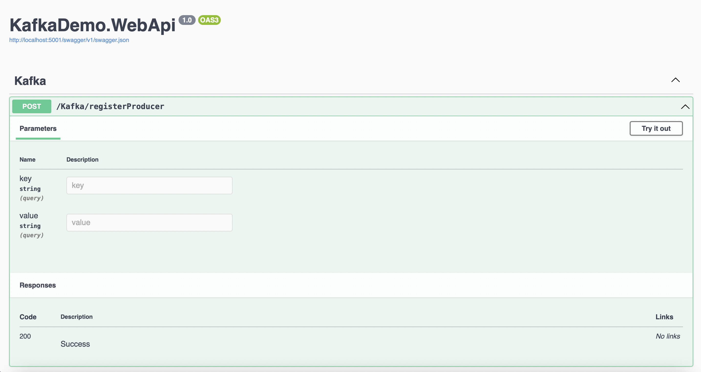
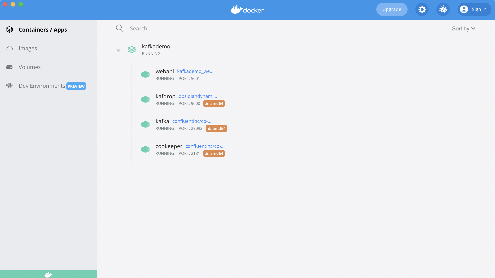
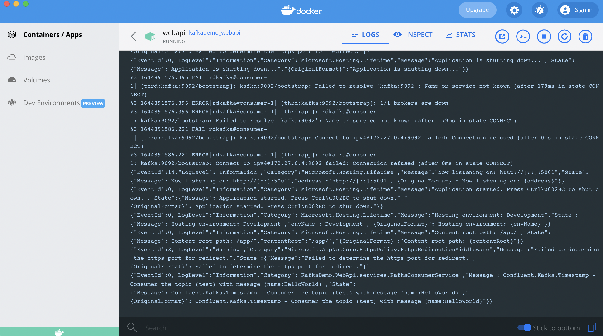

# Project Kafka + .NET6 + Docker

Project example using Producer and Consumer with Kafka and .Net 6. 

Producer it's call using request HttpPost.

Consumer it's use background service. 

Images example below

### Stack: 

- Docker
- Kafka
- WebApi (.Net 6)
